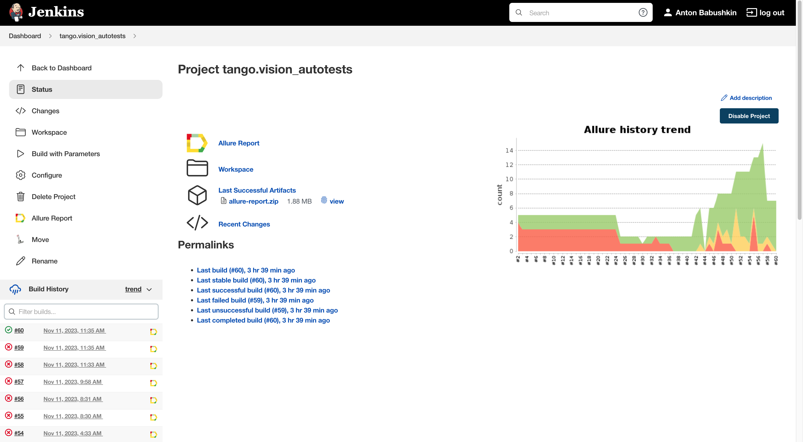
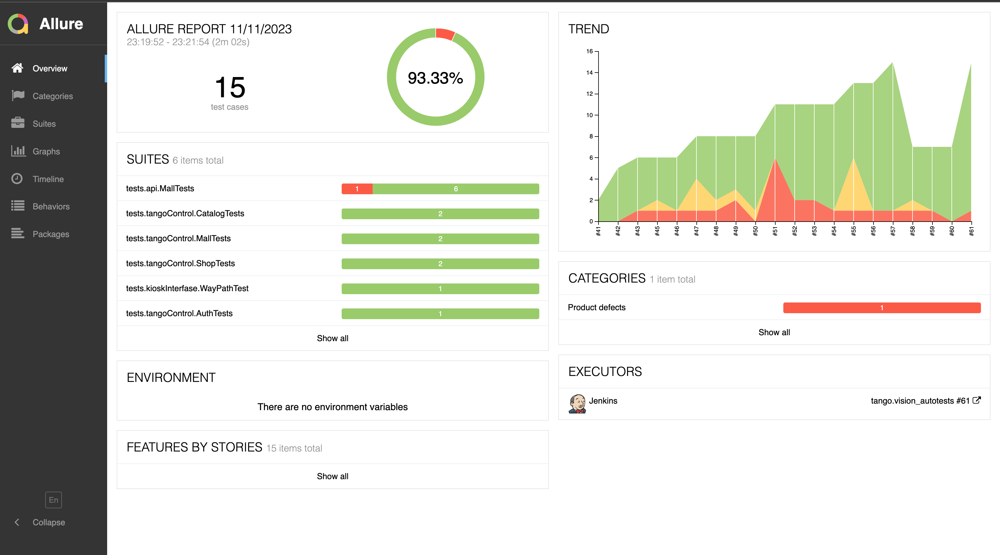
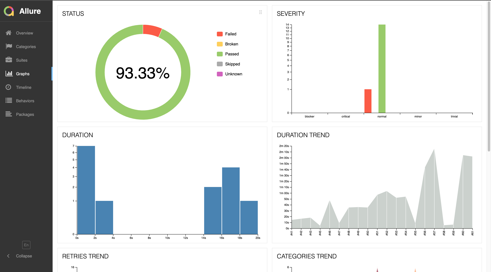
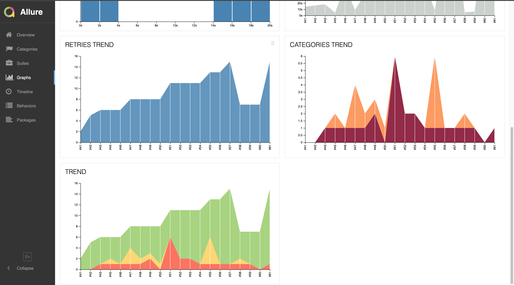
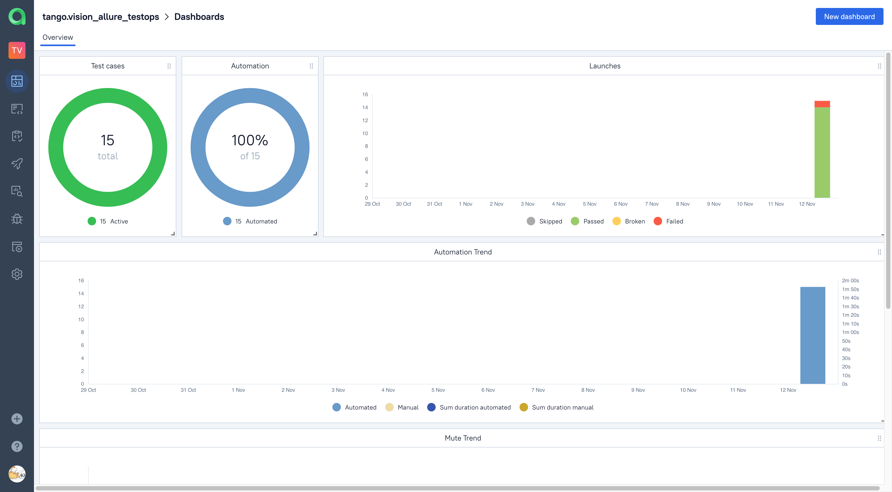
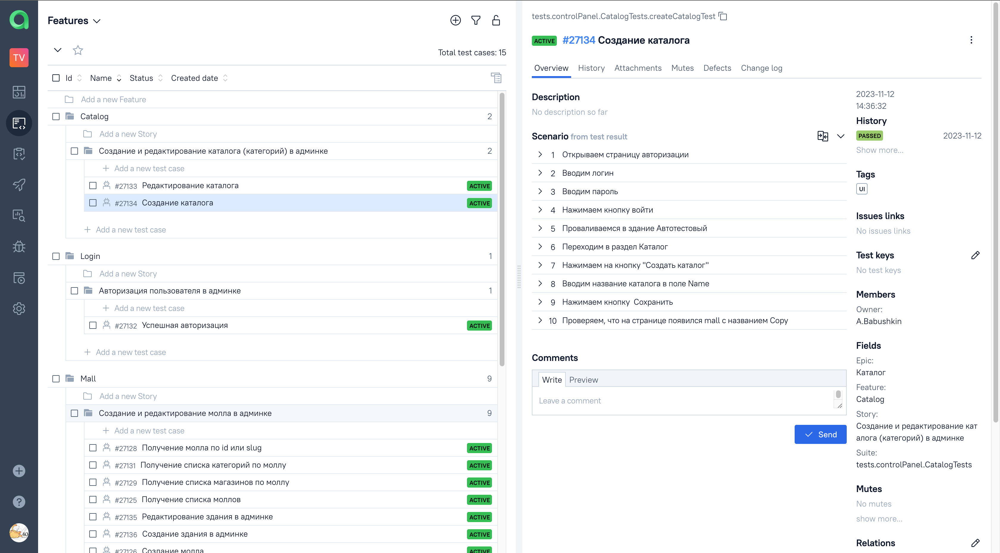
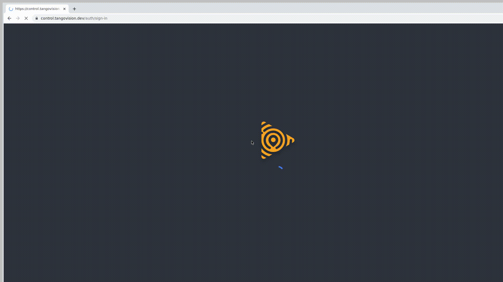

# 
# Проект по автоматизации тестирования  компании [Tango.vision](https://tango.vision/)
<p  align="center">
<a href="https://dostavka.magnit.ru"></a>
</p>
Tango Vision это облачная платформа для повышения эффективности управления коммерческой недвижимостью.
Цифровизация зданий позволяет значительно повысить уровень услуг, предоставляемых в них.

## **Содержание:**
____

* <a href="#tools">Технологии и инструменты</a>

* <a href="#cases">Примеры автоматизированных тест-кейсов</a>

* <a href="#jenkins">Сборка в Jenkins</a>

* <a href="#console">Запуск из терминала</a>

* <a href="#allure">Allure отчет</a>

* <a href="#allure-testops">Интеграция с Allure TestOps</a>

* <a href="#telegram">Уведомление в Telegram при помощи бота</a>

* <a href="#video">Примеры видео выполнения тестов на Selenoid</a>
____
<a id="tools"></a>
## <a name="Технологии и инструменты">**Технологии и инструменты:**</a>

<p align="center">  
<a href="https://www.jetbrains.com/idea/"></a>  
<a href="https://www.java.com/"></a>  
<a href="https://github.com/"></a>  
<a href="https://junit.org/junit5/"></a>  
<a href="https://gradle.org/"></a>  
<a href="https://selenide.org/"></a>  
<a href="https://aerokube.com/selenoid/"></a>  
<a href="ht[images](images)tps://github.com/allure-framework/allure2"></a> 
<a href="https://qameta.io/"></a>   
<a href="https://www.jenkins.io/"></a>  
<a href="https://www.atlassian.com/ru/software/jira/"></a>  
</p>

____
<a id="cases"></a>
## <a name="Примеры автоматизированных тест-кейсов">**Примеры автоматизированных тест-кейсов:**</a>
____
- ✓ *Проверка авторизации пользователя*
- ✓ *Проверка создания нового здания*
- ✓ *Проверка клонирования здания*
- ✓ *Проверка создания магазина*
- ✓ *Проверка добавления описания магазина*
- ✓ *Проверка создания новой категории*
- ✓ *Проверка добавления порядкового номера каталога*


____
<a id="jenkins"></a>
## </a><a name="Сборка"></a>Сборка в [Jenkins](https://jenkins.autotests.cloud/job/tango.vision_autotests/)</a>
____
<p align="center">  
<a href="https://jenkins.autotests.cloud/job/tango.vision_autotests/"></a>  
</p>


### **Параметры сборки в Jenkins:**

- *browser (браузер, по умолчанию chrome)*
- *browserVersion (версия браузера, по умолчанию 100.0)*
- *browserSize (размер окна браузера, по умолчанию 1920x1080)*
- *baseUrl (адрес тестируемого веб-сайта)*
- *remoteUrl (логин, пароль и адрес удаленного сервера Selenoid)*

<a id="console"></a>
## Команды для запуска из терминала
___
***Локальный запуск:***
```bash  
gradle clean test
```

***Удалённый запуск через Jenkins:***
```bash  
clean test
"-Dbrowser=${browser}"
"-DbrowserVersion=${browserVersion}"
"-DbrowserSize=${browserSize}"
"-DbaseUrl=${baseUrl}"
"-DremoteUrl=${remoteUrl}"
```
___
<a id="allure"></a>
## </a> <a name="Allure"></a>Allure [отчет](https://jenkins.autotests.cloud/job/tango.vision_autotests/61/allure/#)</a>
___

### *Основная страница отчёта*

<p align="center">  
  
</p>  

### *Тест-кейсы*

<p align="center">  
  
</p>

### *Графики*

  <p align="center">  


  
</p>

___
<a id="allure-testops"></a>
## </a>Интеграция с <a target="_blank" href="https://allure.autotests.cloud/project/2197/dashboards">Allure TestOps</a>
____
### *Allure TestOps Dashboard*

<p align="center">  
  
</p>  

### *Тест-кейсы*

<p align="center">  
  
</p>

____
<a id="telegram"></a>
## </a> Уведомление в Telegram при помощи бота
____
<p align="center">  
  
</p>

____
<a id="video"></a>
## </a> Примеры видео выполнения тестов на Selenoid
____
<p align="center">
   
</p>

TV_FirstTest